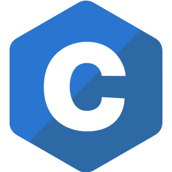

<!--  -->

    &emsp;&emsp;
    &emsp;&emsp;
    

### 𝐋𝐚𝐧𝐠𝐮𝐚𝐠𝐞
>&emsp;&emsp;
&emsp;&emsp;
&emsp;&emsp;
&emsp;&emsp;
&emsp;&emsp;

### 𝐅𝐫𝐚𝐦𝐞𝐰𝐨𝐫𝐤s & 𝐩𝐚𝐜𝐤𝐚𝐠𝐞𝐬
>&emsp;&emsp;
&emsp;&emsp;&emsp; 

### 𝐃𝐚𝐭𝐚𝐛𝐚𝐬𝐞
>&emsp;&emsp;
&emsp;&emsp;
&emsp;&emsp;
&emsp;&emsp;

### 𝐂𝐥𝐨𝐮𝐝
>&emsp;&emsp;
&emsp;&emsp;
&emsp;&emsp;
&emsp;&emsp;
 

### 𝐂𝐨𝐝𝐞 𝐄𝐝𝐢𝐭𝐨𝐫
>&emsp;&emsp;
&emsp;&emsp;
&emsp;&emsp;
&emsp;&emsp;
&emsp;&emsp; 

 

##  **Github Stats:**
 

   
  
 

